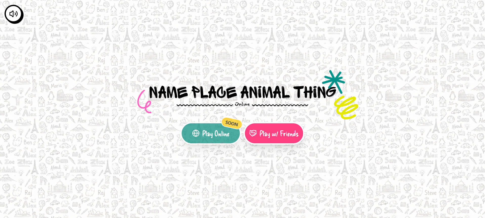
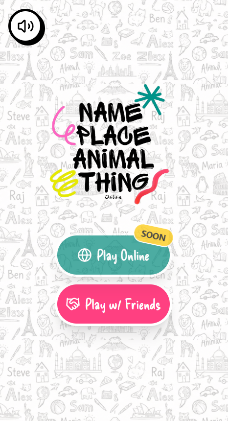
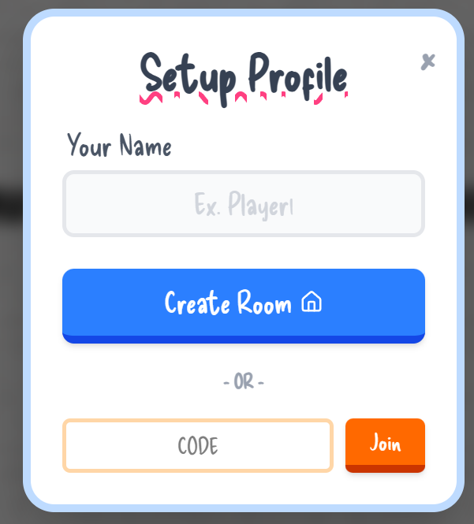
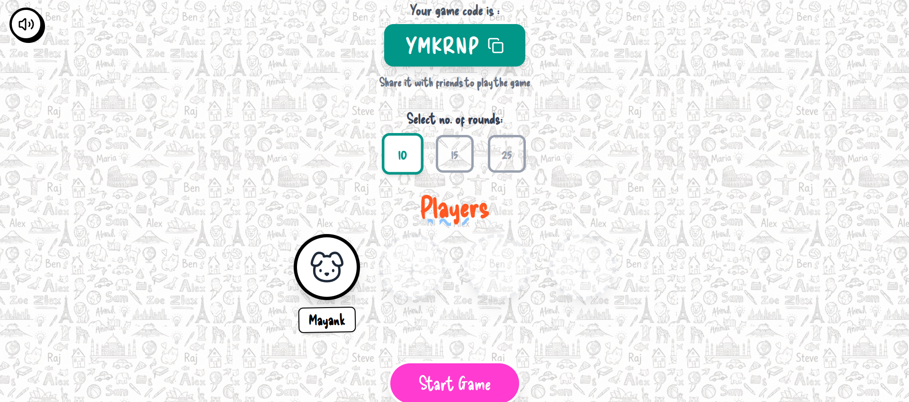
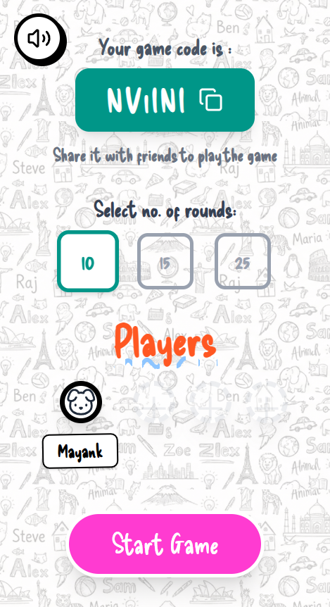
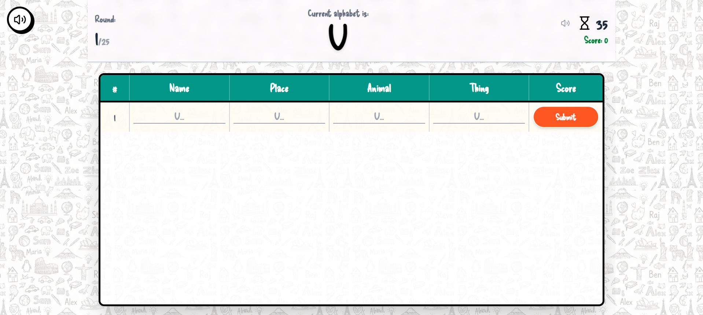
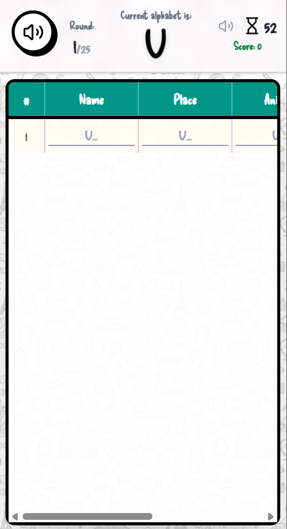
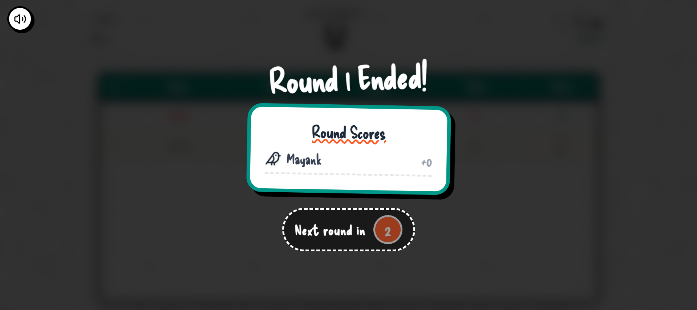
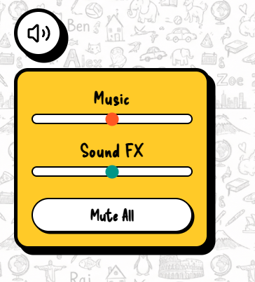

# ✏️ Name Place Animal Thing - Online Multiplayer

A modern, real-time multiplayer web version of the classic childhood game "Name, Place, Animal, Thing". Build rooms, invite friends, and race against the clock. 

The twist? **An AI Referee powered by Google Gemini** instantly validates everyone's answers at the end of the round!

## 📸 Game Preview

### Home Page







### Lobby Screen




### Game Screen





### Cursor


### Audio Slider



## 🎨 Custom UI & Design
A massive focus of this project was creating a nostalgic, tactile, and highly responsive user interface:
* **The "Notebook" Aesthetic:** Built with custom paper-texture backgrounds, chunky borders, solid offset drop-shadows, and the playful `Delicious Handrawn` font.
* **Smart AI Visual Feedback:** When the Gemini AI rejects a fake word, the game board automatically applies a red, hand-drawn strikethrough to the specific cell, mimicking a teacher's red pen.
* **Immersive Audio Controller:** Features a persistent, chunky volume button that opens a drop-down menu with separate sliders for Background Music and UI Sound FX (ticks and clicks).
* **Custom SVG Cursors:** The standard mouse pointer is replaced globally with a custom, hand-drawn red arrow and an interactive hover pointer.
* **Fully Responsive:** The game board utilizes a horizontal-scroll wrapper on mobile devices, ensuring the 5-column table never squishes or breaks on small screens.

## ✨ Core Features
* **Real-time Multiplayer:** Play with friends instantly using `Socket.io` rooms. No accounts required.
* **AI Referee:** Uses `gemini-2.5-flash` to intelligently grade answers (e.g., it knows that "Narwhal" is an animal and "Nainital" is a place).
* **Smart Scoring:** Automatically awards 10 points for unique correct answers and 5 points for duplicate correct answers.
* **Bulletproof Fallbacks:** Features a robust 3-strike AI fallback system. If the primary model times out, the game smoothly transitions to a secondary model, and ultimately an offline validation mode so players never get stuck.

## 🛠️ Tech Stack
* **Frontend:** React.js, Tailwind CSS, Lucide Icons
* **Backend:** Node.js, Express.js
* **Real-time Communication:** Socket.io
* **Artificial Intelligence:** Google Generative AI SDK (Gemini 2.5 API)

## 🚀 Running it Locally

### 1. Clone the repository
```bash
git clone https://github.com/YOUR_USERNAME/npat-online.git
cd npat-online
```

### 2. Setup the Backend (Server)
```bash
cd server
npm install
```
Create a `.env` file in the `server` folder and add your Gemini API Key:
```env
GEMINI_API_KEY=your_google_gemini_api_key_here
```
Start the server (uses IPv4 flag to ensure stable Google API connection):
```bash
npm start 
```

### 3. Setup the Frontend (Client)
Open a *new* terminal window and navigate to the client folder:
```bash
cd client
npm install
npm start
```
The game will now be running at `http://localhost:3000`!